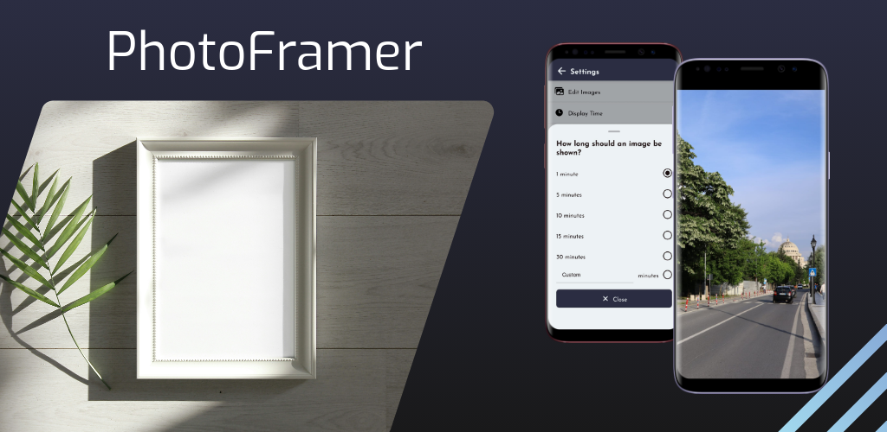

# Welcome to PhotoFramer

This app allows you to transform an old tablet or other device into a digital photo frame.

## Features



Do you have an old tablet device that you're not using? Turn it into a digital photo frame with PhotoFramer! This app allows you to display photos from your device's gallery in a slideshow. You can customize the settings to display photos, set the duration for each photo, and more. Use an old device, to relive old memories!

- Display photos from your device's gallery
- Slideshow mode
- Customizable settings

## Developer Information

### Stack

- Expo Go / React Native

### Setup

1. Install dependencies

   ```bash
   npm install
   ```

2. Start the app

   ```bash
    npx expo start
   ```
